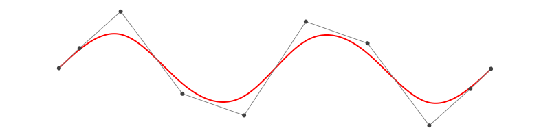
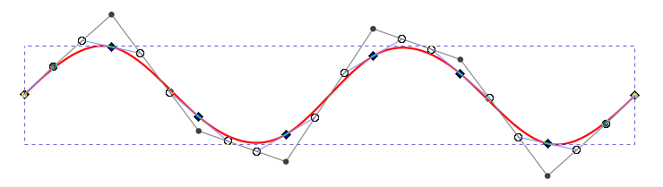

# BasicBSplineFitting

[](https://hyrodium.github.io/BasicBSpline.jl/dev/math-fitting/)
[](https://codecov.io/gh/hyrodium/BasicBSplineFitting.jl)

This package provides `fittingcontrolpoints` and related functions.
These functions have been moved from [BasicBSpline.jl v0.9.0](https://github.com/hyrodium/BasicBSpline.jl/releases/tag/v0.9.0).

## Fitting B-spline manifold
[Try on Desmos graphing calculator!](https://www.desmos.com/calculator/2hm3b1fbdf)

```julia
using BasicBSplineFitting
using BasicBSpline
using BasicBSplineExporter
using StaticArrays

p1 = 2
p2 = 2
k1 = KnotVector(-10:10)+p1*KnotVector([-10,10])
k2 = KnotVector(-10:10)+p2*KnotVector([-10,10])
P1 = BSplineSpace{p1}(k1)
P2 = BSplineSpace{p2}(k2)

f(u1, u2) = SVector(2u1 + sin(u1) + cos(u2) + u2 / 2, 3u2 + sin(u2) + sin(u1) / 2 + u1^2 / 6) / 5

a = fittingcontrolpoints(f, (P1, P2))
M = BSplineManifold(a, (P1, P2))
save_png("fitting.png", M, unitlength=50, xlims=(-10,10), ylims=(-10,10))
```


If the knot vector span is too coarse, the approximation will be coarse.

```julia
using BasicBSplineFitting
using BasicBSpline
using BasicBSplineExporter
using StaticArrays
p1 = 2
p2 = 2
k1 = KnotVector(-10:5:10)+p1*KnotVector([-10,10])
k2 = KnotVector(-10:5:10)+p2*KnotVector([-10,10])
P1 = BSplineSpace{p1}(k1)
P2 = BSplineSpace{p2}(k2)

f(u1, u2) = SVector(2u1 + sin(u1) + cos(u2) + u2 / 2, 3u2 + sin(u2) + sin(u1) / 2 + u1^2 / 6) / 5

a = fittingcontrolpoints(f, (P1, P2))
M = BSplineManifold(a, (P1, P2))
save_png("fitting_coarse.png", M, unitlength=50, xlims=(-10,10), ylims=(-10,10))
```


## Draw smooth vector graphics

```julia
using BasicBSplineFitting
using BasicBSpline
using BasicBSplineExporter
using StaticArrays

p = 3
k = KnotVector(range(-2π,2π,length=8))+p*KnotVector(-2π,2π)
P = BSplineSpace{p}(k)

f(u) = SVector(u,sin(u))

a = fittingcontrolpoints(f, P)
M = BSplineManifold(a, P)
save_svg("sine-curve.svg", M, unitlength=50, xlims=(-2,2), ylims=(-8,8))
save_svg("sine-curve_no-points.svg", M, unitlength=50, xlims=(-2,2), ylims=(-8,8), points=false)
```




This is useful when you edit graphs (or curves) with your favorite vector graphics editor.



See [Plotting smooth graphs with Julia](https://forem.julialang.org/hyrodium/plotting-smooth-graphs-with-julia-6mj) for more tutorials.
